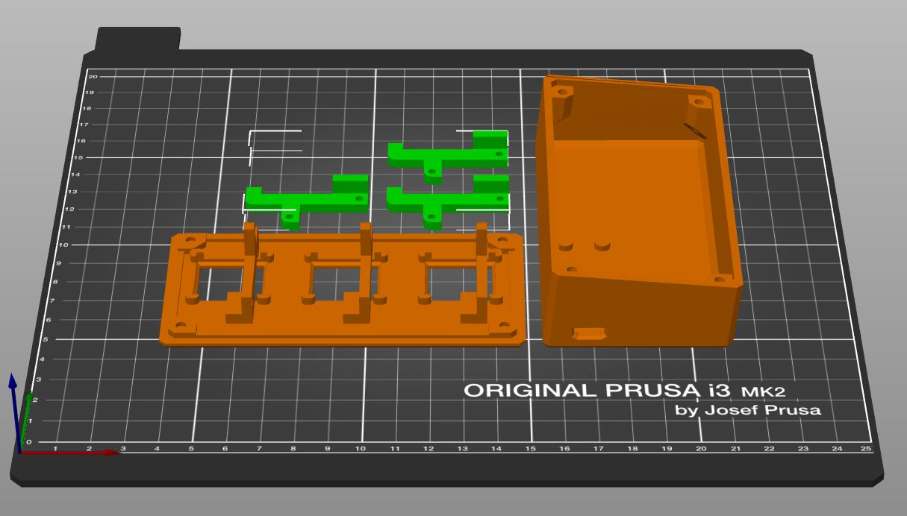
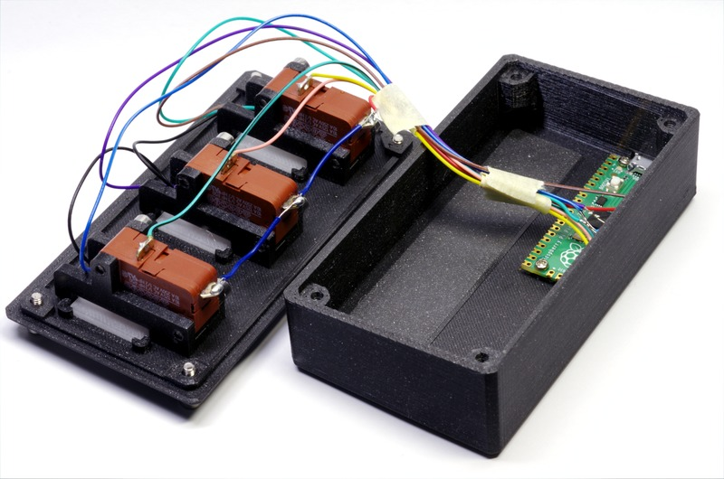

Maker Media GmbH

***

### 3D Druck

 

 Neben dem Gehäuse müssen drei Tasten gedruckt werden. Es gibt dfie Variante mit Kappe, die man z.B. aus PVB-Filament drucken kann, und die ohne Kappe, die man farbig oder transparent für den Gebrauch mit LEDs drucken kann.

 
